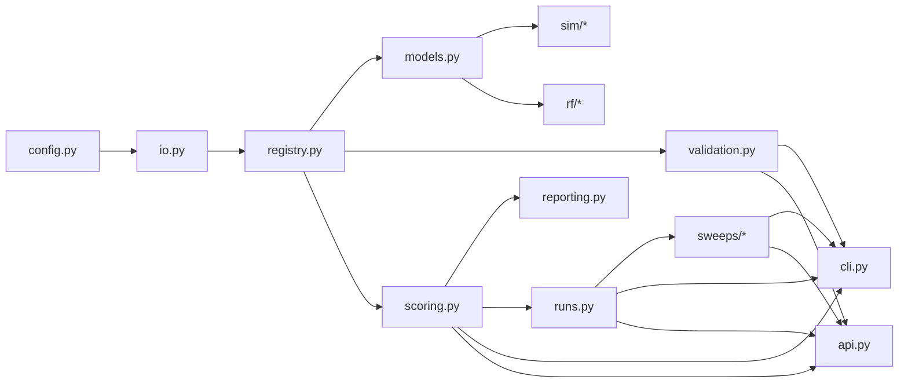
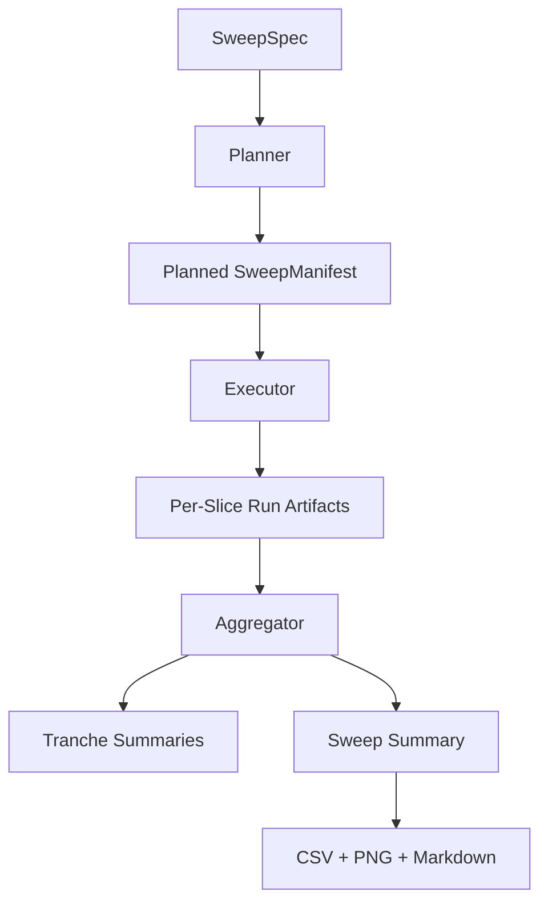

# Architecture

MMM Studio is organized around typed contracts and reproducible execution layers.

The current architecture has three core tiers:

- **registry + validation**: load and validate the seed artifact bundle into a typed `MMMDataset`
- **analysis primitives**: surrogate scoring, reporting, single-run artifact persistence, simulation scaffolds, and RF utilities
- **orchestration surfaces**: CLI, API, and the new sweep planner / executor / aggregator stack

## Module Boundaries

## Sweep Architecture

The sweep layer is intentionally concrete.

- `sweeps/models.py`: typed sweep, tranche, slice, manifest, and summary contracts
- `sweeps/planner.py`: spec loading, candidate scoping, inheritance resolution, input hashing, and manifest planning
- `sweeps/executor.py`: deterministic sequential slice execution with failure isolation
- `sweeps/aggregator.py`: cross-slice overlap, divergence, rank-stability, and robustness metrics
- `sweeps/artifacts.py`: summary JSON/Markdown/CSV/plot persistence and summary loading

The sweep executor does **not** replace the existing scoring path. It uses the current scorer and run-artifact logic as its slice execution primitive.

## Core Design Notes

### Typed registry first

The repository does not treat the seed data as anonymous YAML. Each document is validated into a Pydantic model and assembled into an indexed `MMMDataset`. Sweep planning resolves against those typed objects, not raw dictionaries.

### One real working engine

The first orchestration engine is the existing surrogate scorer. That means current sweep slices are honest about what they do:

1. select a candidate subset from the typed registry
2. score it under a selected surrogate profile
3. persist a per-slice run bundle
4. aggregate tranche and sweep comparisons

No fake solver execution is inserted behind the sweep API.

### Failure isolation over batch fragility

Each slice gets its own directory, run manifest, score table, and metrics bundle. A single slice failure does not erase the entire sweep. The parent `sweep_manifest.json` is updated incrementally so partial progress is still traceable.

### Reproducibility is built into planning

Planned sweep manifests include:

- normalized resolved slice plans
- output locations
- dataset-root provenance
- hashes for the sweep spec and typed registry documents

That keeps planned intent and executed outputs tied together.

## Artifact Flow

## Honest Scope Boundary

Implemented now:

- typed registry operations
- surrogate scoring
- deterministic sweep orchestration
- comparison metrics and reproducible artifacts

Still scaffolded:

- solver-backed tranche execution
- measured RF tranche execution
- distributed workers
- inverse design loops
