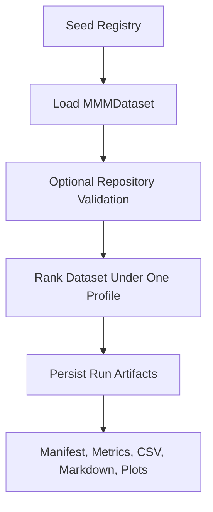
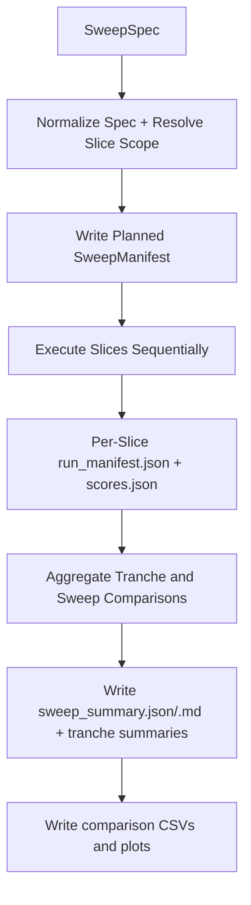

# Pipeline

MMM Studio now has two related execution paths:

- a **single-run scoring path** for one profile over one candidate pool
- a **sweep path** for multiple slices grouped into tranches under one parent manifest

Both paths reuse the same typed registry and surrogate-scoring foundation.

## Single-Run Pipeline



The single-run path is still used by:

- `mmm-studio score`
- `mmm-studio leaderboard`
- `mmm-studio run-demo`
- `/scoring/score`

## Sweep Pipeline



## Sweep Execution Stages

### 1. Plan

The planner resolves:

- effective profile per slice
- effective top-n parameters
- merged global and slice-level filters
- candidate IDs per slice
- deterministic output paths
- input hashes for the spec and registry bundle

### 2. Execute

The executor:

- runs each slice through the existing surrogate scorer
- persists a per-slice artifact bundle
- updates the parent manifest incrementally
- records failures without discarding successful slices

### 3. Aggregate

The aggregator computes:

- per-slice winners
- pairwise top-k overlap and Jaccard similarity
- rank stability and score variance across slices
- candidate robustness and profile-sensitivity metrics

### 4. Publish

The artifact layer writes:

- `sweep_manifest.json`
- `sweep_summary.json`
- `sweep_summary.md`
- `tranche_index.json`
- `aggregate_leaderboard.csv`
- per-tranche JSON and Markdown summaries
- comparison plots

## Directory Layout

```text
<sweep_run_dir>/
  sweep_manifest.json
  sweep_summary.json
  sweep_summary.md
  tranche_index.json
  aggregate_leaderboard.csv
  plots/
  tranches/
    <tranche_id>/
      tranche_summary.json
      tranche_summary.md
      slices/
        <slice_id>/
          run_manifest.json
          scores.json
          metrics.json
```

## Scope Boundaries

What the pipeline does now:

- compare surrogate-ranked candidate subsets in a reproducible way
- preserve per-slice provenance and aggregate comparisons

What it does not do now:

- execute a real solver
- ingest measured RF data into tranche execution
- distribute slices across worker pools
